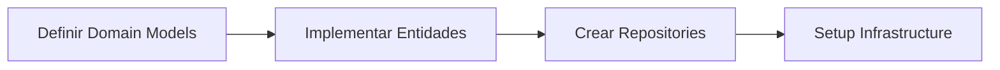
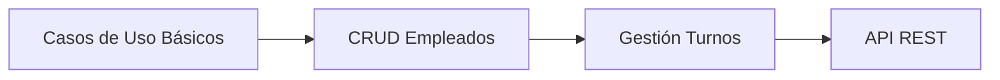
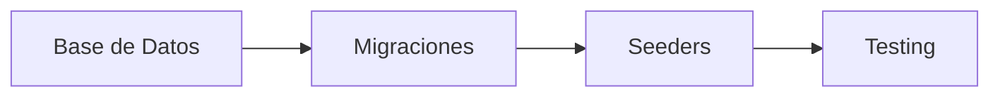
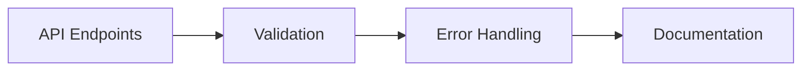

# 🚀 Plan de Entrega Incremental - MVP Sistema de Turnos

## 🎯 MVP (Versión Mínima Viable)

### 📋 **Core Funcional Inicial**
Para el primer entregable, nos enfocamos en el **módulo más crítico y fundamental**:

> ### 📅 **Módulo de Programación Básica**
> - ✅ **Gestión básica de empleados** (CRUD simple)
> - ✅ **Creación Automatizada Calendario x Año** - solo festivos fijos - sistema CRUD para agregar los démas.
> - ✅ **Configuración de turnos simples** por punto de venta
> - ✅ **Asignación manual de turnos** (sin automatización inicial)
> - ✅ **Visualización de horarios** semanales/mensuales
> - ✅ **Consulta básica** para empleados

---

## 🏗️ **Arquitectura Limpia - Estructura Inicial**

### 📦 **Capas Propuestas para MVP:**

```
📁 Domain (Entidades de Negocio)
├── 🏢 Entities/
│   ├── Employee
│   ├── Calendar
│   ├── Shift
│   ├── WorkSchedule
│   └── Store
├── 💎 ValueObjects/
│   ├── Shift
│   ├── Calendar
│   ├── TimeSlot
│   ├── WorkDay
│   └── EmployeeId
└── 📋 Repositories/ (Interfaces)

📁 Application (Casos de Uso)
├── ⚡ UseCases/
│   ├── CreateEmployee
│   ├── AssignShift
│   ├── GetSchedule
│   └── ManageShifts
└── 🔧 Services/ (Interfaces)

📁 Infrastructure (Implementaciones)
├── 🗄️ Persistence/
├── 🌐 External/
└── ⚙️ Configuration/

📁 Presentation (API/UI)
├── 🎮 Controllers/
├── 📤 DTOs/
└── ✅ Validators/
```

---

## 📅 **Roadmap Incremental**

### 🏃‍♂️ **Sprint 1-2 (MVP Base)** `🎯 Prioridad Alta`
| Tarea | Estado | Estimación |
|-------|--------|------------|
| Entidades básicas (Employee, Shift, Schedule) | ⏳ Pendiente | 5 días |
| CRUD de empleados | ⏳ Pendiente | 3 días |
| Calendario anual básico | ⏳ Pendiente | 4 días |
| Configuración simple de turnos | ⏳ Pendiente | 4 días |
| Asignación manual de turnos | ⏳ Pendiente | 5 días |
| API REST básica | ⏳ Pendiente | 3 días |

### 🚀 **Sprint 3-4 (Automatización)** `📊 Prioridad Media`
| Tarea | Estado | Estimación |
|-------|--------|------------|
| Algoritmo de rotación automática | ⏳ Pendiente | 8 días |
| Validaciones de negocio | ⏳ Pendiente | 4 días |
| Manejo de festivos básico | ⏳ Pendiente | 3 días |

### 📈 **Sprint 5-6 (Control de Horas)** `📋 Prioridad Media`
| Tarea | Estado | Estimación |
|-------|--------|------------|
| Registro de horas trabajadas | ⏳ Pendiente | 6 días |
| Cálculo básico de horas extras | ⏳ Pendiente | 5 días |
| Reportes simples | ⏳ Pendiente | 4 días |

### 🔮 **Sprint 7+ (Funcionalidades Avanzadas)** `🌟 Futuro`
| Tarea | Estado | Estimación |
|-------|--------|------------|
| Integración BNET | ⏳ Pendiente | 10 días |
| Módulo de novedades | ⏳ Pendiente | 8 días |
| Alertas y notificaciones | ⏳ Pendiente | 6 días |
| Reportería avanzada | ⏳ Pendiente | 12 días |

---

## 🎯 **Entidades Core del MVP**

### 🏢 **Entidades Principales:**
| Entidad | Propósito | Prioridad |
|---------|-----------|-----------|
| **Employee** | Empleado/Cajero | 🔴 Alta |
| **Shift** | Definición de turno | 🔴 Alta |
| **WorkSchedule** | Programación de horarios | 🔴 Alta |
| **Calendar** | Calendario Anual | 🟡 Media |
| **Store** | Punto de Venta | 🟡 Media |

### 💎 **Value Objects:**
| Value Object | Propósito | Prioridad |
|--------------|-----------|-----------|
| **TimeSlot** | Franja Horaria | 🔴 Alta |
| **WorkDay** | Día Laboral | 🟡 Media |
| **EmployeeId** | Identificador único | 🔴 Alta |

## 🚀 **Plan de Desarrollo - Orden Sugerido**

### 🎯 **Fase 1: Foundation (Semana 1-2)**


### 📋 **Fase 2: Core Features (Semana 3-4)**


### 🗄️ **Fase 3: Persistence (Semana 5)**


### 🌐 **Fase 4: Interface (Semana 6)**


---

## ❓ **Definición del Alcance MVP**

### 📊 **Información Requerida:**

| Pregunta | Respuesta | Impacto |
|----------|-----------|---------|
| ¿Cuántos puntos de venta inicialmente? | `___` | 🏗️ Arquitectura |
| ¿Empleados por punto aproximadamente? | `___` | 📊 Performance |
| ¿Interfaz web o solo API? | `___` | 🎨 Frontend |
| ¿Complejidad del sistema actual? | `___` | 🔄 Migración |

### 🎯 **Criterios de Aceptación MVP:**
- [✅] Un administrador puede crear/editar empleados
- [ ] Un supervisor puede configurar turnos básicos
- [ ] Un supervisor puede asignar turnos manualmente
- [ ] Los empleados pueden consultar sus horarios
- [ ] El sistema genera un calendario visual semanal
- [ ] La API está documentada y funcional

---

## 🔄 **Siguiente Paso**

> **🎯 Acción Inmediata:** 
> 
> **Definir las respuestas a las preguntas del alcance** para proceder con el diseño detallado de las entidades y casos de uso del Domain.

---

### 📞 **¿Listo para comenzar?**
**¿Con cuál de estos aspectos te gustaría comenzar a profundizar primero?**

1. 🏢 **Diseño de Entidades Domain**
2. 📋 **Casos de Uso Detallados**  
3. 🗄️ **Arquitectura de Base de Datos**
4. 🌐 **Estructura de API**